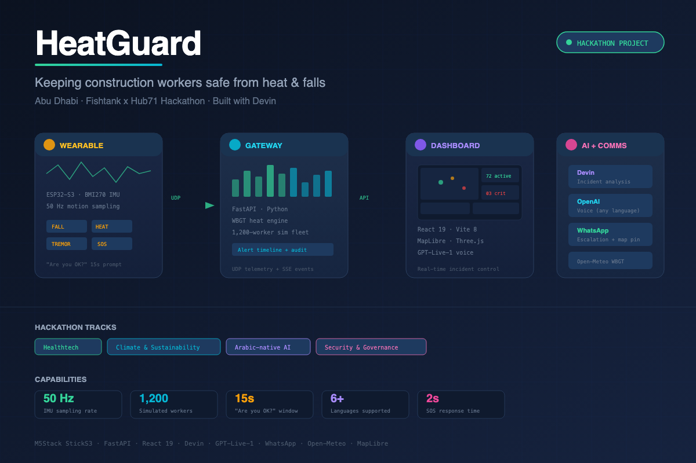

# HeatGuard

**Keeping construction workers safe from heat and falls in Abu Dhabi.**



| | |
|---|---|
| Demo Video | [youtu.be/cBoCmNquzvs](https://youtu.be/cBoCmNquzvs) |
| Control Room Dashboard | [aman-dashboard-varun.netlify.app](https://aman-dashboard-varun.netlify.app/) |
| Wearable Admin Panel | [telemetry-backend…/admin](https://telemetry-backend-501582454609.asia-northeast1.run.app/admin) |
| Device Photo |  |

---

## What is this?

HeatGuard is a wrist wearable + site gateway system that protects outdoor construction workers in the UAE from heat stress and falls. Built at the **Fishtank x Hub71 Abu Dhabi Hackathon** using **Devin** as an AI-powered coding teammate.

**Tracks:** Healthtech, Climate & Sustainability, Arabic-native AI, Security & Governance.

## The problem

- UAE summer air temperatures exceed 45 °C with high humidity. Heat exhaustion can turn into heat stroke within minutes.
- Falls are the leading cause of construction fatalities, and heat makes them more likely.
- Many workers don't read English or Arabic. Safety systems that rely on text screens don't reach them.

## What HeatGuard does

| On the wrist (works offline) | On the site gateway |
|---|---|
| Work/rest timer from WBGT heat plan | WBGT heat engine per zone, ACGIH work/rest scheduling |
| Fall detection (free-fall + impact + stillness) | Live dashboard: wearables + 1,200-worker simulated fleet |
| Tremor/seizure-like shaking detection | Devin incident analysis with structured verdicts |
| Inactivity alerts during work cycles | WhatsApp escalation with map pin + Arabic summary |
| "Are you OK?" prompt (15 s to respond) | Voice assistant relay (OpenAI, any language) |
| SOS button (hold 2 s) / Push-to-talk voice | GPT-Live-1 voice in the control room dashboard |

## Architecture

```
  StickS3 wearable (wrist)                  Site gateway (Mac / Raspberry Pi)
 +--------------------------+  UDP 47800  +---------------------------------+
 | IMU 50 Hz -> detectors   | ----------> | FastAPI server                  | --> Dashboard (React/Vite)
 | fall / tremor / erratic  |  telemetry  | WBGT heat engine                | --> Devin API (analysis)
 | inactivity / SOS         |  + events   | alerts + audit timeline         | --> OpenAI (voice)
 | "are you OK?" prompt     | <---------- | UDP gateway                     | --> WhatsApp (escalation)
 | work/rest timer          |  plan, acks | simulated 1,200-worker fleet    |
 | push-to-talk mic/speaker | <---------> | voice relay                     |
 +--------------------------+  TCP 47802  +---------------------------------+
```

Detection runs **on the wrist** so it works in milliseconds with no network. Analysis goes to **Devin** for structured verdicts, evidence, and threshold tuning suggestions.

## Tech stack

- **Device:** M5Stack StickS3 (ESP32-S3), BMI270 IMU, MicroPython
- **Backend:** Python, FastAPI, asyncio, UDP telemetry
- **Frontend:** React 19, Vite 8, MapLibre GL, Three.js, GSAP
- **AI:** Devin (incident analysis), OpenAI GPT-Live-1 (voice), OpenAI Realtime API (wrist voice)
- **Integrations:** WhatsApp (Twilio / Meta / CallMeBot), Open-Meteo weather
- **Deployment:** Netlify (dashboard), launchd/systemd (gateway)

## Repository layout

```
device/           wearable firmware (MicroPython)
backend/          gateway server: API, heat engine, Devin, voice, WhatsApp
frontend/         control room dashboard (React 19 / Vite 8)
scripts/          run, flash, WiFi, service install, demo helpers
docs/             API reference, device protocol, services
```

## Quick start

```bash
# Install frontend dependencies
npm install

# Run the dashboard in demo mode (no hardware or backend needed)
npm run dev:frontend

# Run both frontend + backend together
npm run dev
```

## Team

Built with Devin at the Fishtank x Hub71 Abu Dhabi Hackathon.
