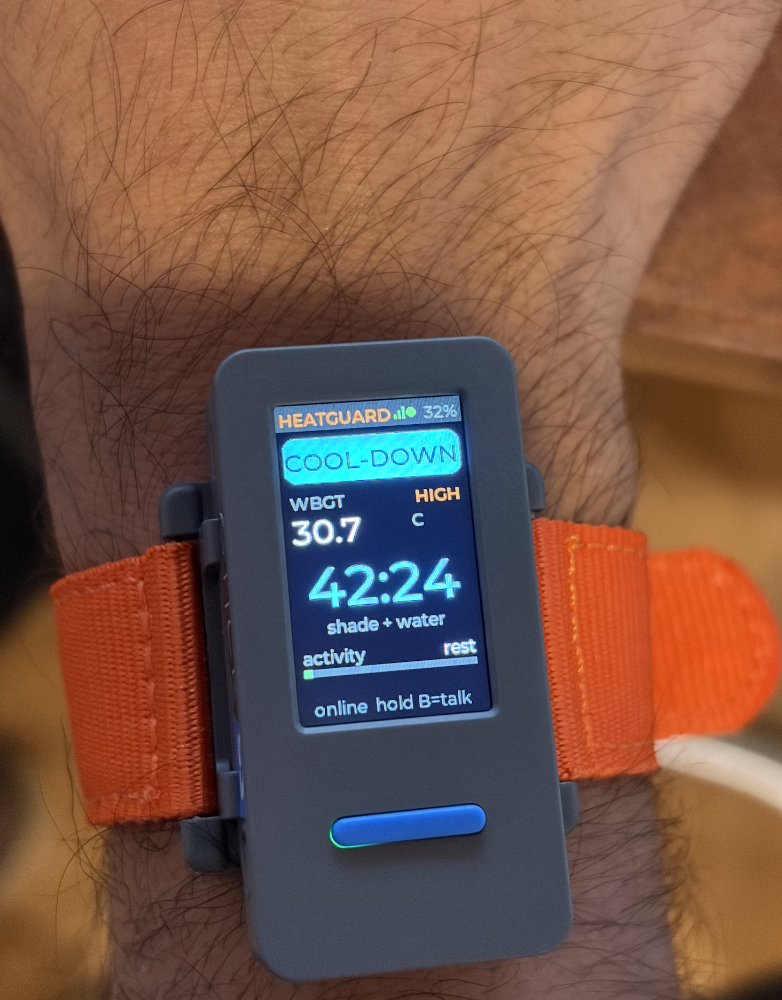
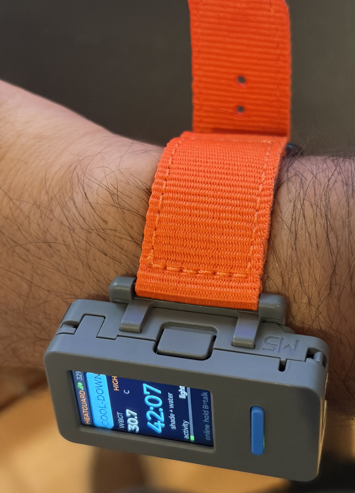

# HeatGuard

<p align="center">
  
  
</p>


A wrist wearable and site gateway that keep outdoor construction and labour-camp workers in the UAE safe from heat stress and falls. It runs heat-based work/rest cycles on the wrist, detects falls and unusual movement on the device, shows a live supervisor dashboard, gets a second opinion on each incident from Devin, answers workers' questions by voice in their own language, and sends WhatsApp escalations to the site medic.

Hardware: M5Stack StickS3 (ESP32-S3, BMI270 IMU, mic + speaker, 135×240 screen). Tracks: Healthtech · Climate & Sustainability · Arabic-native AI · Security & Governance.

---

## The problem

- Summer air temperatures on UAE sites regularly pass 45 °C, often with high humidity on the coast. Heat exhaustion can turn into heat stroke within minutes, and the early signs (dizziness, confusion) are the same signs that stop a worker asking for help.
- Falls are the leading cause of construction deaths, and heat makes them likelier through fatigue, dizziness and sweaty grip. A worker who falls alone on a large site can lie unseen for a long time.
- The UAE's midday break bans outdoor work in direct sun from 12:30 to 15:00 between 15 June and 15 September. Outside that window, supervisors still need to know how long each crew can safely work in the current heat, and the answer changes by the hour, the zone, the workload and whether the worker is acclimatized.
- Many workers don't read English or Arabic well. A safety system that only speaks English on a screen doesn't reach them.

## What HeatGuard does

| On the wrist (no network needed) | On the site gateway |
|---|---|
| Work/rest timer from the WBGT plan: buzzes for **COOL-DOWN** and **BACK TO WORK** | Heat engine: WBGT estimate per zone, ACGIH work/rest per worker, UAE midday break |
| **Fall detection** (free-fall → impact → stillness, or hard impact → stillness) | Live dashboard: live wearables, a 1,200-worker simulated fleet, alerts, IMU trace |
| **Unusual movement**: rhythmic 3–12 Hz shaking (tremor/seizure-like) and sustained flailing | **Devin** incident analysis: structured verdict + threshold suggestions |
| **Inactivity** during a work cycle | **WhatsApp** escalation with a map pin and an Arabic summary |
| Every alarm asks **"Are you OK?"** for 15 s: press = fine, no answer = escalate | **Voice assistant** relay to the OpenAI Realtime API |
| **SOS**: hold the front button 2 s. **Talk**: hold the side button, speak, release | Discovery beacon, so wearables find the gateway on any LAN |

## Architecture

```
  StickS3 wearable (wrist)                  Site gateway (Mac or Raspberry Pi)
 +--------------------------+  UDP 47800  +---------------------------------+
 | IMU 50 Hz -> detectors   | ----------> | FastAPI server  (server/app.py) | --> Dashboard  http://gateway:8000 (SSE)
 | fall / tremor / erratic  |  telemetry, | heat engine     (heat.py)       | --> Devin API  (incident analysis)
 | inactivity / SOS         |  events     | alerts + audit timeline         | --> OpenAI Realtime (voice)
 | "are you OK?" prompt     | <---------- | UDP gateway     (gateway.py)    | --> WhatsApp (Twilio / Meta / CallMeBot)
 | work/rest timer          |  plan, acks | simulated fleet (sim.py)        | <-- Open-Meteo weather
 | push-to-talk mic/speaker | <---------> | voice relay     (services/)     |
 +--------------------------+  TCP 47802  +---------------------------------+
            ^                                  | UDP 47801 discovery beacon (broadcast every 2 s)
            +----------------------------------+
            USB serial: same JSON protocol, used as a fallback when there is no WiFi
```

Telemetry goes over UDP so a slow or lost packet never stalls the 50 Hz sampling loop. Alarm events carry a sequence number and are resent every second until the gateway acks them, so the one message that must arrive does. Contracts: [`docs/api.md`](docs/api.md), [`docs/services.md`](docs/services.md).

## Why detection runs on the wrist and analysis goes to Devin

Safety-critical detection has to work in milliseconds, with the WiFi down, in a basement stairwell. So the whole detector runs on the wearable: the fall state machine, the 2 s spectral window for shaking, the stillness check and the "are you OK?" prompt. If the gateway drops, the wrist keeps timing the work/rest cycle on its own.

Understanding an incident is different. It's slower, it isn't in the safety path, and it benefits from real computation and an explanation. When an alarm escalates, the gateway sends Devin the raw IMU window around the event (19 s at 25 Hz), the heat context, the worker's workload and exposure, and the detector's own thresholds. Devin works the numbers in its sandbox: |a| over time, free-fall duration, impact peak, post-impact stillness, dominant shaking frequency by FFT. It returns a **structured verdict** against a JSON schema:

```json
{"verdict": "true_fall", "confidence": 0.82, "summary": "...",
 "evidence": ["Free-fall 420 ms, impact 3.4 g", "..."],
 "recommended_actions": ["Send the nearest first-aider now", "..."],
 "suggested_threshold_changes": [{"parameter": "IMPACT_G", "current": 1.8, "proposed": 2.2, "rationale": "..."}]}
```

Verdicts: `true_fall`, `false_alarm`, `tremor_or_seizure_like`, `erratic_movement`, `heat_illness_risk`, `needs_human_review`.

**The tuning loop.** `suggested_threshold_changes` use the firmware's own parameter names (`IMPACT_G`, `TREM_MIN_DPS`, `INACT_S`, ...). A false alarm the worker dismissed with "I'm OK" is evidence the detector fired too easily, and a true fall that barely crossed a threshold is evidence it nearly missed. A human reviews each suggestion. The wearable accepts new values through the `cfg` downlink command, so an approved change doesn't need a reflash. Nothing retunes itself.

Details: Devin API v3 sessions with `structured_output_schema`, capped at `DEVIN_MAX_ACU` (default 2) per session. Auto-analysis runs only for escalated falls/shaking/inactivity, at most one every 90 s, never for simulated alerts. Without a Devin key, or if a session fails, a transparent local analyser fills the same schema. `GET /api/v1/alerts/{id}/devin_prompt` shows exactly what Devin was sent.

## Heat model

- **WBGT estimate** from live Open-Meteo weather (air temperature, humidity, wind, solar radiation): `WBGT = 0.7·Tnwb + 0.2·Tg + 0.1·Ta`, with the natural wet-bulb from Stull's formula plus a solar term, and the globe temperature from solar load and wind. Computed per zone (a shaded basement isn't a sunny façade).
- **Risk category**: Low < 27 °C, Moderate < 29.4, High < 31.1, Very high < 32.2, Extreme above that.
- **Work/rest per hour** from the ACGIH TLV screening criteria: 45/15, 30/30, 15/45, 10/50 minutes, or stop work. **Workload** (light/moderate/heavy) comes from the wrist's activity index.
- **Acclimatization**: workers in their first weeks on site get the stricter ACGIH Action Limit table.
- **UAE midday break**: 12:30–15:00, 15 Jun – 15 Sep, shown on the dashboard and applied to the plan.
- The gateway pushes each worker's plan to the wrist (`{"cmd":"plan", ...}`). Working through a mandatory cool-down raises a "Working during cool-down" alert.

## Voice assistant on the wrist

Hold the side button, ask a question in any language, release. Audio streams to the gateway as 24 kHz PCM over TCP and on to the OpenAI Realtime API (default model `gpt-realtime-2.1`). The reply plays on the wrist speaker, with a short caption on screen. The assistant knows the worker's heat plan and can act through four tools:

| Tool | Effect |
|---|---|
| `get_heat_status` | current WBGT, category, minutes worked / left, rest remaining |
| `report_symptoms` | creates an alert (critical if severe) and starts a cool-down |
| `start_cool_down` | puts the worker on a rest break now |
| `request_help` | critical alert + WhatsApp escalation |

So a worker can ask in Hindi "मुझे चक्कर आ रहा है" ("I feel dizzy"), in Arabic "كم دقيقة باقية على الاستراحة؟" ("how long until my break?"), or in Urdu, Bengali or Malayalam, and get an answer in the same language. The transcript appears in the dashboard's voice log.

## WhatsApp escalation

When an alarm goes unanswered (or on SOS, a voice help request, or the dashboard's Notify button), the gateway sends each HSE officer or medic one message they can act on in five seconds:

```
*CRITICAL: Fall detected · NO RESPONSE*
*Worker:* Ravi Kumar · Steel fixer · Crew B-2
*Where:* Tower B · Level 4 · Dubai South · Tower B site (demo)
*When:* 13:05 Dubai time (Fri 25 Sep)
*Detected:* Free-fall 180 ms, impact 3.4 g, then no movement. ...
*Response:* *NO ANSWER* to the "Are you OK?" prompt on the wearable.
*Heat:* WBGT 32.4 °C · Extreme (air 41 °C)
*Do now:* Send the nearest first-aider now. Don't move them if a head or neck injury is possible.
*Call 998 (Ambulance) if unresponsive.*
*Map* (site pin + zone; the wearable has no GPS):
https://maps.google.com/?q=24.8962,55.1602
تنبيه سلامة (حرج): سقوط عامل – Ravi Kumar، Tower B · Level 4، الساعة 13:05. لم يرد على سؤال «هل أنت بخير؟» على السوار. ...
```

With Meta's Cloud API a native WhatsApp location pin follows the text. Phone numbers are masked (`+9715•••••123`) everywhere they're logged or shown. The same alert goes to the same number at most once a minute unless its severity rises. With no provider configured, HeatGuard runs a **dry run**: the message is composed, shown on the dashboard and written to the log, and nothing is sent.

| Provider | `WHATSAPP_PROVIDER` | Env vars (plus `WHATSAPP_TO=+9715...,+9715...`) |
|---|---|---|
| Dry run (default) | `dryrun` | none |
| Twilio | `twilio` | `TWILIO_ACCOUNT_SID`, `TWILIO_AUTH_TOKEN`, `TWILIO_WHATSAPP_FROM` (e.g. `whatsapp:+14155238886` for the sandbox) |
| Meta Cloud API | `meta` | `META_WA_TOKEN`, `META_WA_PHONE_ID`; optional `META_WA_TEMPLATE`, `META_WA_TEMPLATE_LANG`, `META_WA_TEMPLATE_PARAMS` |
| CallMeBot | `callmebot` | `CALLMEBOT_APIKEY` (first `WHATSAPP_TO` number only) |

Optional: `HEATGUARD_PUBLIC_URL` adds a dashboard link. WhatsApp only delivers business-initiated free text inside a 24-hour window, so a production Meta setup needs an approved template (`META_WA_TEMPLATE`). Self-test with no network: `.venv/bin/python scripts/test_whatsapp.py`.

## Scaling to thousands of workers

- **One gateway per site or camp.** A single asyncio process handles UDP telemetry, the heat engine and the dashboard. The simulated 1,200-worker fleet runs through the same engine in the same process, alongside the live wearables.
- **Detection is on the wrist**, so gateway load grows with telemetry, not with analysis. Nothing on the server has to keep up at 50 Hz per worker for anyone to be safe.
- **Humans see exceptions, not streams.** The fleet view is one tile per worker, and supervisors act on alerts.
- **Bandwidth.** The demo streams raw IMU at 10 packets/s so the trace plots live, about 20 kbit/s per wearable. At fleet scale the wearable would send 1 Hz status plus the IMU window attached to each alarm, a few hundred bytes per second per worker, well within one access point per zone.
- **Devin cost is bounded**: per-session ACU cap, rate-limited auto-analysis, escalated incidents only.
- Multi-site rollup (gateways forwarding alerts and aggregates to a regional HSE view) is the next step, not built yet.

## Privacy and governance

- **Minimal data.** The wearable sends motion, the chip temperature, battery and button events. It has no GPS and no camera. The microphone is only on while the talk button is held.
- **No audio stored.** Voice audio is relayed to the Realtime API and back and never written to disk. The dashboard shows only the recent transcript lines.
- **Data stays on the site gateway.** State is held in memory on the gateway. The only things that leave the site are: site coordinates to Open-Meteo, an incident's IMU window and context to Devin (the prompt uses the worker ID and trade; the demo session title includes the name, which a production build would drop), a question's audio to OpenAI while the button is held, and escalation text to the configured WhatsApp numbers.
- **Per-worker consent.** The deployment model is opt-in at induction, explained in the worker's language, with a rule that the data is for safety only and never for productivity scoring or discipline. That's policy, not something the code can enforce.
- **Human in the loop.** Devin's threshold changes are suggestions a person approves. Every alert keeps a timeline (device events, supervisor ack/resolve/false alarm, WhatsApp sends), which doubles as an audit trail.
- **Secrets.** Keys are loaded at runtime from `.env` or a secrets file and never logged. The launchd plist and systemd unit contain none. Phone numbers are masked in logs and on the dashboard.
- **Honest labelling.** Every simulated alert carries `simulated: true`, and its WhatsApp message says SIMULATED.

## Known limits

- **Chip temperature isn't skin or core temperature.** The StickS3 reports its own chip temperature, which follows the device and the sun, not the body. It's shown as device temperature and never used as a clinical sign.
- **WBGT is estimated** from weather data with a screening formula. A real site should feed a WBGT meter in through `POST /api/v1/ingest` (`temperature`, `source: ambient`).
- **Detection thresholds are demo-tuned**, not clinically validated. Expect false alarms (that's what "Are you OK?" absorbs) and misses. HeatGuard is not a medical device.
- **No GPS on this board.** Location is the site pin plus the worker's assigned zone and crew. Per-zone BLE beacons would be the next step.
- **Workload** comes from wrist motion, a rough stand-in for metabolic rate.
- **In-memory state.** A gateway restart clears alert history.
- **WhatsApp delivery isn't guaranteed** (templates, 24 h window, sandbox opt-in). Keep radio and phone escalation in the site's emergency plan.

---

## Quick start

Prerequisites: Python 3.13 venv with `fastapi uvicorn httpx pyserial mpremote websockets`, a StickS3 with UiFlow2 MicroPython, and the laptop and wearable on the same WiFi. Networks with client isolation (hotel or guest WiFi) block wearable-to-laptop traffic, so use a phone hotspot there.

```bash
python3 -m venv .venv && .venv/bin/pip install fastapi uvicorn httpx pyserial mpremote websockets

# 1. Keys: .env holds DEVIN= (Devin cog_ service key) and OPENAI= (OpenAI key)
cp .env.example .env          # then edit .env; it is gitignored

# 2. WiFi for the wearable (USB). Password is prompted, hidden, never stored on the laptop.
.venv/bin/python scripts/set_wifi.py                 # or: --ssid SiteWiFi [--server 192.168.1.10]

# 3. Flash the firmware
scripts/flash.sh                                     # optional: scripts/flash.sh /dev/cu.usbmodemXXXX

# 4. Run the gateway
scripts/run.sh                                       # PORT=8000 by default

# 5. Open the dashboard
open http://localhost:8000
```

Key precedence in `scripts/run.sh`: an exported env var wins over `.env`, which wins over the machine secrets file. The Devin org ID is looked up automatically. Without `OPENAI` the voice assistant is offline. Without `DEVIN` the local analyser handles incidents. With no WhatsApp provider it's a dry run.

**As a service.** macOS: `scripts/install_service.sh install | status | logs | uninstall` (a LaunchAgent that starts at login and restarts on exit, with logs in `~/Library/Logs/heatguard/server.log`). Linux site gateway (e.g. a Raspberry Pi at the camp): `deploy/heatguard.service` with `EnvironmentFile=/etc/heatguard/heatguard.env` (template: `deploy/heatguard.env.example`), running as a non-root `heatguard` user. Install steps are in the unit file header.

No WiFi? Plug the wearable in over USB. The gateway reads the same protocol over serial automatically.

## Demo script (3 minutes)

Setup: dashboard on the big screen, wearable on the presenter's wrist, a cushion on the table, a phone showing WhatsApp. `API=http://localhost:8000/api/v1`.

| Time | Do | Show |
|---|---|---|
| 0:00 | Open the dashboard | 1,200-worker fleet tiles, the live wearable, site WBGT and today's work/rest policy |
| 0:20 | Push the heat: dashboard **Override** or `curl -X POST $API/site/override -H 'Content-Type: application/json' -d '{"temp_c":46,"rh":45,"sun":true}'` | WBGT jumps to Extreme, the plan tightens, the wrist shows the new work/rest split |
| 0:35 | Time-warp: `curl -X POST $API/demo -H 'Content-Type: application/json' -d '{"timewarp":60}'` | The work budget runs out in seconds, the wrist buzzes **COOL-DOWN**, and the fleet turns to rest |
| 0:55 | Keep moving your arm during the cool-down, then sit still | "Working during cool-down" alert, then **BACK TO WORK** when the rest ends |
| 1:15 | Drop the wearable onto the cushion, then press the front button within 15 s | "Fall detected · worker OK": resolved on the wrist, no escalation |
| 1:30 | Drop it again and don't answer | After 15 s: **NO RESPONSE**, critical alert, WhatsApp escalation, and Devin analysis starts |
| 1:55 | Open the alert | IMU trace, then Devin's verdict, evidence and threshold suggestion, with a link to the Devin session (sessions take a few minutes, so have an earlier one ready) |
| 2:20 | Hold the side button and ask in Hindi "मुझे चक्कर आ रहा है" or in Arabic "كم دقيقة باقية على الاستراحة؟" | A spoken answer in the same language. Symptoms trigger a cool-down and an alert, and the transcript shows in the voice log |
| 2:45 | Hold up the phone | The WhatsApp message: worker, zone, no-answer status, WBGT, map pin, Arabic line, "Call 998" |

Reset: `curl -X POST $API/demo -H 'Content-Type: application/json' -d '{"timewarp":1}'` and `curl -X DELETE $API/site/override`.

## API summary

Full reference: [`docs/api.md`](docs/api.md) (device ingest, serial protocol, dashboard API) and [`docs/services.md`](docs/services.md) (UDP/voice protocols, WhatsApp and assistant contracts).

| Endpoint | Purpose |
|---|---|
| `GET /api/v1/state` · `GET /api/v1/stream` (SSE) | Snapshot, then live `worker`, `fleet`, `alert`, `site`, `imu`, `voice`, `notify` events |
| `POST /api/v1/ingest` | Device ingest over HTTP (alternative to UDP) |
| `GET /api/v1/workers[/{id}]` · `POST /api/v1/workers/{id}/command` | Worker detail; `rest`, `resume`, `buzz`, `msg` |
| `POST /api/v1/alerts/{id}/ack \| resolve \| false_alarm` | Supervisor actions (kept in the alert timeline) |
| `POST /api/v1/alerts/{id}/devin` · `GET .../window` · `GET .../devin_prompt` | Run analysis, raw IMU window, exact prompt sent |
| `POST /api/v1/alerts/{id}/notify` | Send the WhatsApp escalation now |
| `POST` / `DELETE /api/v1/site/override` | Demo heat override / back to live weather |
| `POST /api/v1/demo` | `{"timewarp": 1-120, "sim_events": bool}` |
| `GET` / `POST /api/v1/bridge` | Release or retake the USB serial port (used by the flash and WiFi scripts) |

## Repository layout

```
device/main.py                 wearable firmware (UiFlow2 MicroPython)
server/app.py                  gateway server: state, alerts, heat plans, SSE, API
server/heat.py                 WBGT, ACGIH work/rest, UAE midday break
server/devin.py                Devin session + local analyser
server/gateway.py              UDP gateway, discovery beacon, USB serial bridge
server/sim.py                  simulated fleet
server/services/assistant.py   OpenAI Realtime voice relay
server/services/whatsapp.py    WhatsApp escalation
server/static/index.html       dashboard
scripts/                       run, flash, set_wifi, install_service, test_whatsapp
deploy/                        launchd plist, systemd unit, env template
```
